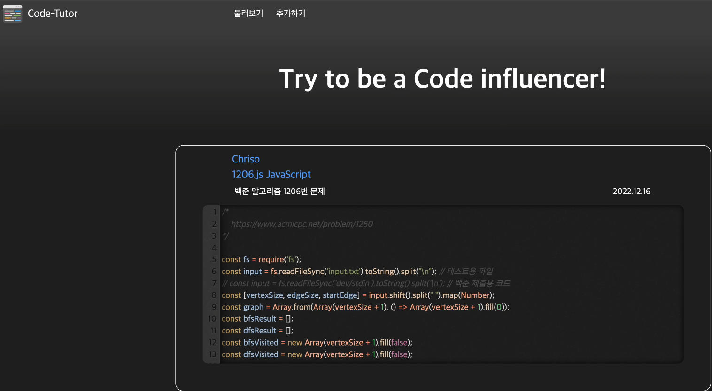

# CodeTutor
소스코드를 게시물처럼 등록하고 공유하는 사이트

## Introduce

메인화면으로 업로드 된 소스코드들을 확인할 수 있다.

소스코드 등록화면으로 함수 명, 키워드, 언어, 소스코드를 작성하여 등록할 수 있다.

탐색 화면으로 키워드를 통해 검색할 수 있고, 날짜 순, 특정 언어만 검색 등의 기능을 활용할 수 있다.

## 개발 환경
### spring boot

### MySQL

### JDBC

### CodeMirror

### EC2

